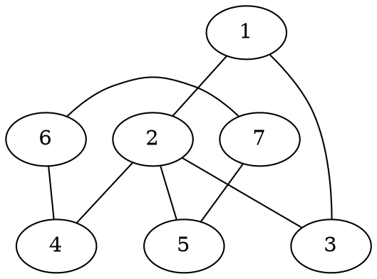
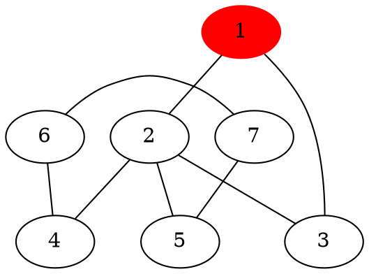
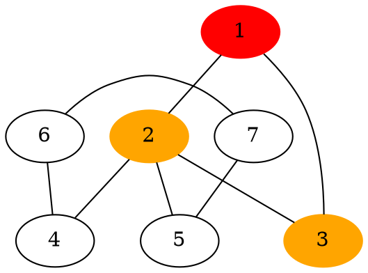
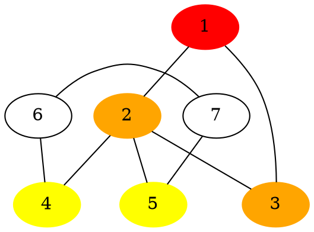
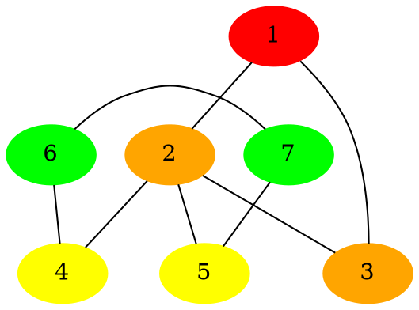
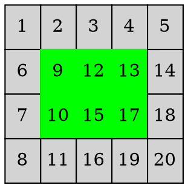
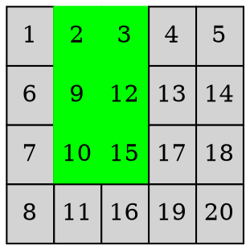
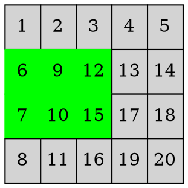
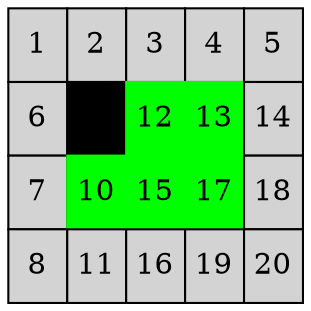

# 戰場投送

---

## 圖論



---

## 建圖

| Node | Adjacent nodes |
| ---- |:--------------:|
| 1    |      2、3      |
| 2    |   1、3、4、5   |
| 3    |      1、2      |
| 4    |      2、6      |
| 5    |      2、7      |
| 6    |      4、7      |
| 7    |      5、6      |

---

## 建圖

* 開 $n$ 個動態陣列
* 對於每個點 $i$，計算有幾個鄰居 $d_i$
* 將第 $i$ 個動態陣列的大小改成 $d_i$
* 將 $i$ 的鄰居存在第 $i$ 個動態陣列之中

---

```cpp=
const int N = 20 * 20 + 9;
int adj[N][6]; // at most 6 neighbors
int adj_sz[N];

void add_edge(int a, int b) { // an edge between a and b
    adj[a][adj_sz[a]] = b;
    adj_sz[a] += 1;
    adj[b][adj_sz[b]] = a;
    adj_sz[b] += 1;
}

```

---

也可以使用二維陣列，但不推薦，因為效率太差

|     | 1   | 2   | 3   | 4   | 5   |  6  | 7   |
| --- | --- | --- | --- | --- | --- |:---:| --- |
| 1   |     | *   | *   |     |     |     |     |
| 2   | *   |     | *   | *   | *   |     |     |
| 3   | *   | *   |     |     |     |     |     |
| 4   |     | *   |     |     |     |  *  |     |
| 5   |     | *   |     |     |     |     | *   |
| 6   |     |     |     | *   |     |     | *   |
| 7   |     |     |     |     | *   |  *  |     |


---

## 最短路

BFS（廣度優先搜索演算法）

---

## 最短路

紅色：$0$



---

## 最短路

紅色：$0$、橘色：$1$



---

## 最短路

紅色：$0$、橘色：$1$、黃色：$2$



---

## 最短路

紅色：$0$、橘色：$1$、黃色：$2$、綠色：$3$



---

## 最短路

實作上，開兩個長度為 $n$ 的陣列 $d_1, d_2$。
從距離由小到大進行處理
$d_1$ 存當前距離的點
$d_2$ 存 $d_1$ 中的點的鄰居

---

## 最短路

$d1$：$\{1\}$
$d2$：$\{2, 3\}$

| 1   | 2   | 3   | 4   | 5   | 6   |  7  |
| --- | --- | --- | --- | --- | --- |:---:|
| 0   | inf | inf | inf | inf | inf | inf |


---

## 最短路

$d1$：$\{2, 3\}$
$d2$：$\{4, 5\}$

| 1   | 2   |  3  | 4   | 5   | 6   |  7  |
| --- | --- |:---:| --- | --- | --- |:---:|
| 0   | 1   |  1  | inf | inf | inf | inf |


---

## 最短路

$d1$：$\{4, 5\}$
$d2$：$\{6, 7\}$

| 1   | 2   |  3  | 4   |  5  | 6   |  7  |
| --- | --- |:---:| --- |:---:| --- |:---:|
| 0   | 1   |  1  | 2   |  2  | inf | inf |


---

## 最短路

$d1$：$\{6, 7\}$
$d2$：$\{\}$

| 1   | 2   |  3  | 4   |  5  | 6   |  7  |
| --- | --- |:---:| --- |:---:| --- |:---:|
| 0   | 1   |  1  | 2   |  2  | 3   |  3  |


---

## 最短路

* $d_1$ 存當前距離的節點、$d_2$ 存 $d_1$ 中的點的鄰居
* 處理完當前的距離 $D$
* 將 $d_2$ 中的元素搬到 $d_1$ 中
* 將 $d_1$ 的點的鄰居放到 $d_2$ 中
* 繼續處理距離 $D + 1$

---

## 最短路

```cpp=
const int N = 20 * 20 + 10; // depend on the size of graph
int* adj[N]; // the edges
int adj_sz[N]; // number of i's neighbors

int d1[N], d1_sz;
int d2[N], d2_sz;
int D[N][N]; // D[a][b] : the min dis between a and b
bool vis[N];

void Bfs(int st) {
    memset(vis, 0, sizeof(vis));
    
    d1[0] = st;
    d1_sz = 1;
    d2_sz = 0;
    
    int now = 0;
    while (d1_sz != 0) {
        // put d1's neighbors into d2
        for (int i = 0; i < d1_sz; ++ i) {
            int res = d1[i];
            for (int j = 0; j < adj_sz[res]; ++ j) {
                if (vis[adj[res][j]] == false) {
                    d2[d2_sz] = adj[res][j];
                    d2_sz += 1;
                }
            }
        }
        
        // the distance of d1's nodes is now
        for (int i = 0; i < d1_sz; ++ i) {
            D[st][i] = now;
            vis[i] = true;
        }
        
        // replace d1 with d2, then clear d2
        for (int i = 0; i < d2_sz; ++ i) d1[i] = d2[i];
        d1_sz = d2_sz;
        d2_sz = 0;

        now += 1;
    }
}

```

---

## 找出最短路

沿著距離遞減往回走

| 1   | 2   |  3  | 4   |  5  | 6   |  7  |
| --- | --- |:---:| --- |:---:| --- |:---:|
| 0   | 1   |  1  | 2   |  2  | 3   |  3  |


---

```cpp=
// the previous node on the min path between st and f
int prev(int st, int f) {
    for (int i = 0; i < adj_sz[f]; ++ i) {
        int res = adj[f][i];
        if (D[st][res] == D[st][f] - 1)
            return res;
    }
}
```

---

## 最短路

* 如果要對任兩點求最短路徑
* 則要做 $n$ 次 BFS
* 第 $i$ 次以 $i$ 作為起點

---

## 軍卡移動

可以想像成是 $13、17$ 這兩格移到其他部位



---

## 軍卡移動

可以想像成是 $13、17$ 這兩格移到其他部位



---

## 軍卡移動

可以想像成是 $13、17$ 這兩格移到其他部位



---

## 軍卡移動

對於 $9、10$ 兩個亦同


---

## 軍卡建圖

我們將軍卡所處的位置、狀態，看成圖論中的一個節點


---

## 軍卡建圖

兩種軍卡位置若可以在一步內轉換，則連上一條邊


這兩者間會連邊


---

## 軍卡建圖

如果一個狀態包含障礙物，則要略過



---

## 軍卡建圖

可以知道，一個狀態至多會連接到六個狀態


---

## 軍卡建圖

對建出來的圖，可以用 BFS 求最短路徑


---

## 戰略點覆蓋問題

一個戰略點會被多種軍卡的狀態覆蓋
EX：$12$ 是戰略點

```graphviz
graph {
    layout="patchwork"
    node [style=filled]
    "1"
    "2"
    "3"
    "4"
    "5"
    "6"
    "7"
    "8"
    "9" [color="green"]
    "10" [color="green"]
    "11"
    "12" [color="green"]
    "13" [color="green"]
    "14"
    "15" [color="green"]
    "16"
    "17" [color="green"]
    "18"
    "19"
    "20"
}
```

```graphviz
graph {
    layout="patchwork"
    node [style=filled]
    "1"
    "2"
    "3"
    "4"
    "5"
    "6"
    "7"
    "8"
    "9" 
    "10"
    "11"
    "12" [color="green"]
    "13" [color="green"]
    "14"
    "15" [color="green"]
    "16" [color="green"]
    "17" [color="green"]
    "18"
    "19" [color="green"]
    "20"
}
```

---

## 戰略點覆蓋問題

可以發現，覆蓋一個戰略點的狀態中，最遠的兩者的距離為 $3$
$\{1, 6\}\rightarrow\{4, 13\}$
$\{2, 9\}\rightarrow\{15, 17\}$
$\{3, 4\}\rightarrow\{16, 19\}$

```graphviz
graph {
    layout="patchwork"
    node [style=filled]
    "1" [color="green"]
    "2" [color="green"]
    "3" [color="green"]
    "4"
    "5"
    "6" [color="green"]
    "7"
    "8"
    "9" [color="green"]
    "10" 
    "11"
    "12" [color="green"]
    "13" 
    "14"
    "15" 
    "16"
    "17" 
    "18"
    "19"
    "20"
}
```

```graphviz
graph {
    layout="patchwork"
    node [style=filled]
    "1"
    "2"
    "3"
    "4"
    "5"
    "6"
    "7"
    "8"
    "9" 
    "10"
    "11"
    "12" [color="green"]
    "13" [color="green"]
    "14"
    "15" [color="green"]
    "16" [color="green"]
    "17" [color="green"]
    "18"
    "19" [color="green"]
    "20"
}
```

---

## 戰略點覆蓋問題

換句話說，如果隨機對每個戰略點指定一種覆蓋
與最佳解的距離至多差 $3$

又因為一台軍卡至多補給 $3$ 個戰略點
因此在隨機指定下，至多差 $9$

反過來說，一種軍卡狀態也可能覆蓋多個戰略點

---

## 戰略點覆蓋問題

也有可能隨機到兩個戰略點可以在一起，卻被分開
EX：$12、13$ 是戰略點
$12$ 被隨機到左（上）圖的狀態
$13$ 被隨機到右（下）圖的狀態

```graphviz
graph {
    layout="patchwork"
    node [style=filled]
    "1"
    "2"
    "3"
    "4"
    "5"
    "6"
    "7"
    "8"
    "9" 
    "10"
    "11"
    "12" [color="green"]
    "13" [color="green"]
    "14"
    "15" [color="green"]
    "16" [color="green"]
    "17" [color="green"]
    "18"
    "19" [color="green"]
    "20"
}
```

```graphviz
graph {
    layout="patchwork"
    node [style=filled]
    "1"
    "2"
    "3"
    "4"
    "5"
    "6"
    "7"
    "8"
    "9" [color="green"]
    "10" [color="green"]
    "11"
    "12" [color="green"]
    "13" [color="green"]
    "14"
    "15" [color="green"]
    "16" 
    "17" [color="green"]
    "18"
    "19" 
    "20"
}
```

---

## 戰略點覆蓋問題

* 可以直接將這兩種軍卡覆蓋情況分開考慮
* 因為兩種狀態的距離至多是 $3$
* 具體要怎麼實作還是看你們想怎麼做

---

## 軍卡、戰略點建圖

隨機的情況下，或許可以建出這樣的圖
逗號後的數字代表這個點上包含幾個戰略點

```graphviz
graph{
    {rank=same "7, 2" "6, 0"}
    {rank=same "4, 1" "5, 2"}
    "1, 0" -- "2, 1"
    "2, 1" -- "3, 3"
    "1, 0" -- "3, 3"
    "2, 1" -- "4, 1"
    "2, 1" -- "5, 2"
    "4, 1" -- "6, 0"
    "6, 0" -- "7, 2"
    "7, 2" -- "5, 2"
}
```

---

## 最少軍卡數量

建出圖之後，可以發現圖或許是一塊一塊的
兩塊之間無法互通
可以使用 DFS 來求出每個連通塊

```graphviz
graph{
    {rank=same "7, 2" "6, 0"}
    {rank=same "4, 1" "5, 2"}
    "1, 0" -- "2, 1"
    "2, 1" -- "3, 3"
    "1, 0" -- "3, 3"
    "2, 1" -- "4, 1"
    "2, 1" -- "5, 2"
    "4, 1" -- "6, 0"
    "6, 0" -- "7, 2"
    "7, 2" -- "5, 2"
    
    {rank=same "9, 1" "10, 0"}
    "8, 1" -- "9, 1"
    "8, 1" -- "10, 0"
    "9, 1" -- "10, 0"
}
```

---

## 最少軍卡數量

左邊那塊的戰略點數量為 $9$
右邊那塊的戰略點數量為 $2$

```graphviz
graph{
    {rank=same "7, 2" "6, 0"}
    {rank=same "4, 1" "5, 2"}
    "1, 0" -- "2, 1"
    "2, 1" -- "3, 3"
    "1, 0" -- "3, 3"
    "2, 1" -- "4, 1"
    "2, 1" -- "5, 2"
    "4, 1" -- "6, 0"
    "6, 0" -- "7, 2"
    "7, 2" -- "5, 2"
    
    {rank=same "9, 1" "10, 0"}
    "8, 1" -- "9, 1"
    "8, 1" -- "10, 0"
    "9, 1" -- "10, 0"
}
```

---

## 最少軍卡數量

因此所需最少軍卡為 $\lceil 9 / 3\rceil + \lceil 2 / 3\rceil = 4$

```graphviz
graph{
    {rank=same "7, 2" "6, 0"}
    {rank=same "4, 1" "5, 2"}
    "1, 0" -- "2, 1"
    "2, 1" -- "3, 3"
    "1, 0" -- "3, 3"
    "2, 1" -- "4, 1"
    "2, 1" -- "5, 2"
    "4, 1" -- "6, 0"
    "6, 0" -- "7, 2"
    "7, 2" -- "5, 2"
    
    {rank=same "9, 1" "10, 0"}
    "8, 1" -- "9, 1"
    "8, 1" -- "10, 0"
    "9, 1" -- "10, 0"
}
```

---

## 最少軍卡數量

注意以下情況，雖然戰略點總數是 $6$
但還是需要 $3$ 台軍卡才夠

```graphviz
graph{
    {rank=same "2, 1" "3, 0"}
    "1, 1" -- "2, 1"
    "2, 1" -- "3, 0"
    "3, 0" -- "1, 1"
    
    {rank=same "5, 1" "6, 2"}
    "4, 1" -- "5, 1"
    "5, 1" -- "6, 2"
    "4, 1" -- "6, 2"
}
```

---

## 最少軍卡數量

* 以 DFS 尋找每個連通塊
* 統計每個連通塊包含幾個戰略點
* 將每個連通塊的答案各自除 $3$ 取上高斯後加總

---

## 軍卡路線規劃

* 這題相當於要在每個連通塊上放入足夠數量的軍卡
* 並規劃這些軍卡的路線
* 最優解大概是很難的問題

---

## 軍卡路線規劃

或許可以採取以下策略：

* 優先處理覆蓋到三個戰略點的狀態
* 每個狀態盡量走到距離自己較近的狀態
* 將軍卡盡量分散的放在連通塊上
* 加入一點隨機的要素，然後多跑幾遍取最好的
* ... etc